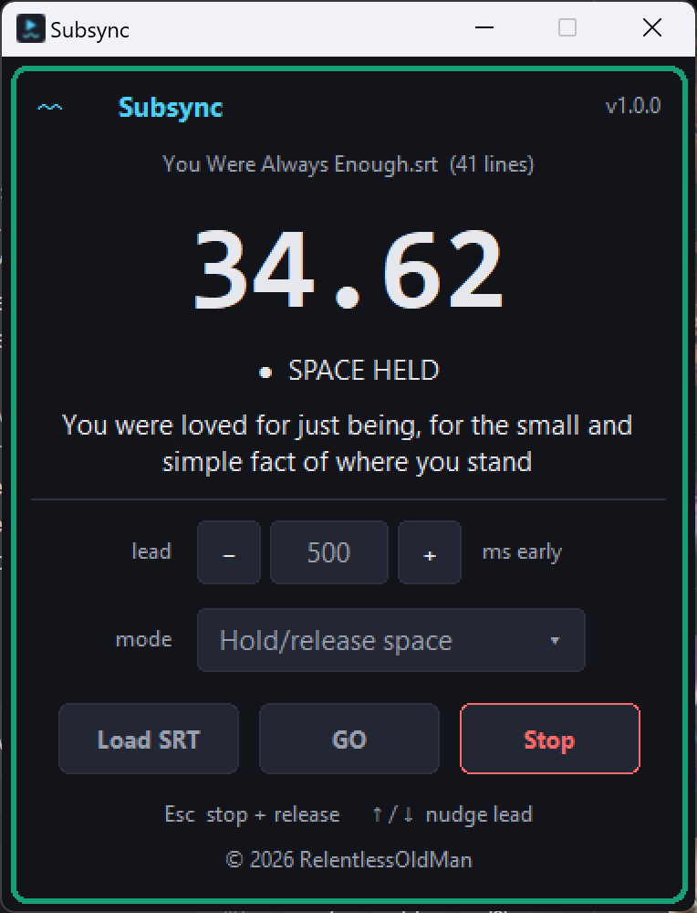
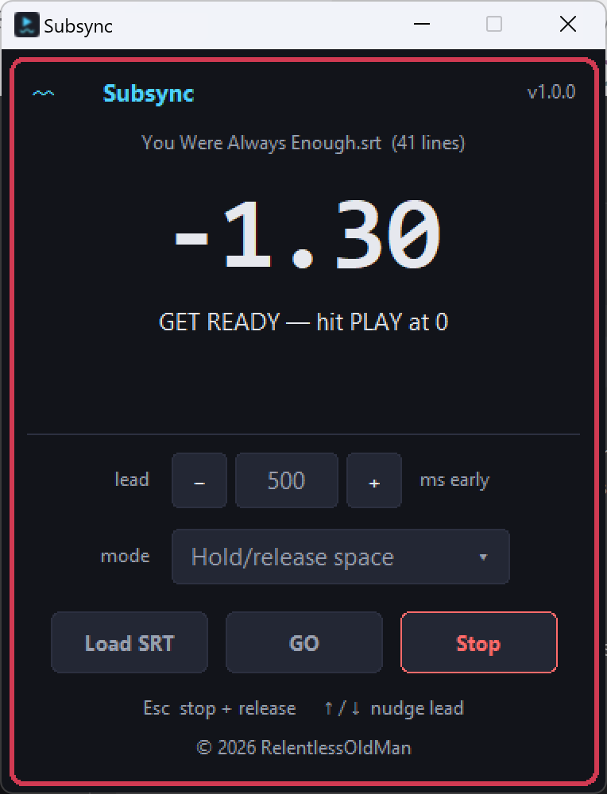
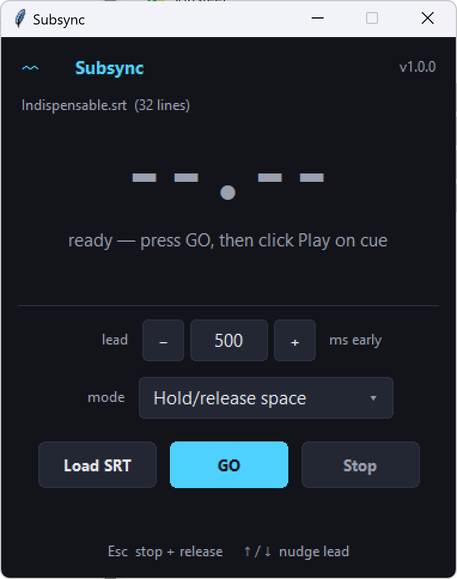

# Subsync 〰️▶

**Play your subtitles into another app.** A tiny, always-on-top, dependency-free desktop tool that
reads a song's `.srt` and drives a synced-lyric display (YouTube Music, etc.) by firing keystrokes
*in time with the audio* — so a lagging lyric track can be nudged back into sync by hand.

It's a **single Python file** with **zero dependencies** beyond the standard library. No `pip
install`, no build step. Windows only (uses the Win32 `SendInput` API).



Sibling to [Subtap](https://github.com/RelentlessOldMan/Subtap): Subtap *edits* subtitle timings by
ear; **Subsync plays that timing back** into whatever app has keyboard focus. Same family, same colors.

## Why

A synced-lyric display (like the one DistroKid publishes to YouTube Music) often lags the audio by
a beat, and there's no knob to fix it on the listener's end. So you drive it yourself: **hold a key
while a line is showing, release it in the gaps**, and the display snaps back into time. Subsync
does exactly that on autopilot — it reads the `.srt` you already have and plays that timeline out as
keystrokes, with a lead you can dial in to beat the lag.

## What it does

1. **Load an `.srt`** for the song.
2. **Pick a mode:**
   - **Hold/release space** — holds the spacebar for each lyric line's duration and releases it in
     the gaps, following the `.srt` timeline.
   - **Type lyrics** — types each line (paced ~25 ms/char) at its start time; handy for testing
     against Notepad before you point it at the real player.
3. **Set the lead (ms)** — keys fire this many ms *before* the `.srt` time to beat display lag.
   Default 500 ms; type a value or nudge in 10 ms steps (`−`/`+` or `↑`/`↓`).
4. **Hit GO** — a 3 s count-in ticks down (screen **red**) at 0.01 s resolution. At zero the screen
   turns **green** ("CLICK PLAY NOW") — click Play on the song. That instant is `t = 0`, and the
   keystrokes follow the `.srt` from there.

Keys land on whatever window has keyboard focus, so after GO, click into the song/player window —
the keys go there, not to Subsync.

<p align="center">
  
  &nbsp;
  
  <br>
  <em>The window stays on your dark theme; a rounded outline lights up only while it's
  running — <strong>rose</strong> during the 3 s count-in, <strong>teal</strong> while it plays
  (top), and nothing at rest (right).</em>
</p>

## Requirements

- Python 3.8+ (Windows — uses the Win32 `SendInput` API)
- No browser, no packages. It's a native Tk window on your global Python.

## Usage

**No Python?** Download **`Subsync.exe`** from the
[latest release](https://github.com/RelentlessOldMan/Subsync/releases/latest) and double-click it —
it's a self-contained build, nothing to install.

Otherwise, on your own Python 3.8+:

```sh
python subsync.py                       # then Load SRT from the UI
python subsync.py "path/to/song.srt"    # pre-load an .srt
```

> **Windows:** double-click **`Subsync.cmd`** (it launches windowless), or drag an `.srt` onto it
> to pre-load that song.

### Keys

`Esc` stop + release · `↑` / `↓` nudge lead ±10 ms

## The lead, and why it's there

The whole point is fighting display lag, and lag isn't constant across players or machines — so the
**lead** is front and center. A lead of `500` means every keystroke fires 500 ms *early*; a negative
lead fires *late*. Nudge it while you watch a line land, and it's tuned in a few passes. The box
accepts `500`, `-200`, even `500 ms`, and clamps to a sane −2 … +5 s.

## How it works

Keystrokes go out through the Win32 `SendInput` API via `ctypes` — scancode-based space (most
compatible with games and players), Unicode typing, and Enter. A single `perf_counter` clock projects
the "click Play" instant, runs a red count-in down to zero, then walks a pre-built schedule of key
events, firing each as it comes due. Typing mode drains through a self-throttling pump (one char
every 25 ms) so the target app's input queue never floods. That's the whole thing, in one file.

Curious? Everything lives in `subsync.py` — the `SendInput` plumbing up top, then the `.srt` parser,
then the `App` class with the clock and the UI. Run `python subsync.py --demo` to see the window
posed with sample content (add `run` for the green playing state).

## Known limitation

Some `.srt`s pad a caption's **end** time out to the next line's start, so a line "shows" straight
through a long instrumental. Subsync faithfully holds space that whole time — the pause isn't a gap
in the file, it's baked into the timing. That's an `.srt` data issue, not an app bug: fix it in
[Subtap](https://github.com/RelentlessOldMan/Subtap) by trimming the line's end to where the vocal actually stops.

## Layout

```
Subsync/
  subsync.py           the whole thing — key injection + srt parser + UI, one file, stdlib only
  Subsync.cmd          double-click to run it windowless (Windows); drag an .srt on to pre-load
  subsync.ico          window + taskbar icon
  make_icon.py         regenerates subsync.ico (pure stdlib, no PIL)
  release.ps1          one-shot: bump version, tag, cut a GitHub release with subsync.py attached
  docs/                hero images (posed --demo renders)
  README.md  LICENSE  .gitignore
```

## Contributing

This is a personal tool, published as-is — **issues and pull requests aren't accepted** (PRs
auto-close). Fork it and make it your own. 〰️

## License

MIT — see [LICENSE](LICENSE). © 2026 RelentlessOldMan.
